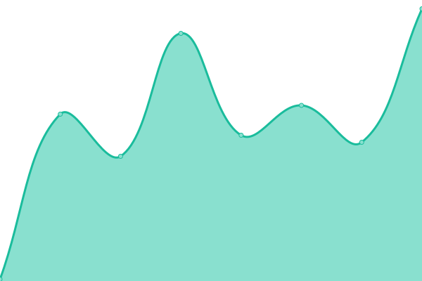
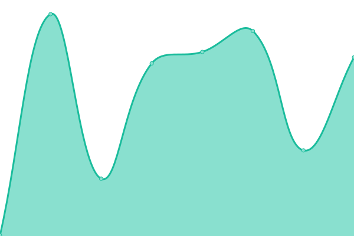

# [📈 Live Status](https://ash-development.github.io/upptime): <!--live status--> **🟩 All systems operational**

This repository contains the open-source uptime monitor and status page for [ash](https://ash-development.github.io/upptime), powered by [Upptime](https://github.com/upptime/upptime).

With [Upptime](https://upptime.js.org), you can get your own unlimited and free uptime monitor and status page, powered entirely by a GitHub repository. We use [Issues](https://github.com/ash-development/upptime/issues) as incident reports, [Actions](https://github.com/ash-development/upptime/actions) as uptime monitors, and [Pages](https://ash-development.github.io/upptime) for the status page.

<!--start: status pages-->
<!-- This summary is generated by Upptime (https://github.com/upptime/upptime) -->
<!-- Do not edit this manually, your changes will be overwritten -->
<!-- prettier-ignore -->
| URL | Status | History | Response Time | Uptime |
| --- | ------ | ------- | ------------- | ------ |
|  [Google](https://www.google.com) | 🟩 Up | [google.yml](https://github.com/ash-development/upptime/commits/HEAD/history/google.yml) | 

 126ms
     
 | 

<a href="https://ash-development.github.io/upptime/history/google">100.00%</a>
    

|  [Main Site](https://ashie.lol) | 🟩 Up | [main-site.yml](https://github.com/ash-development/upptime/commits/HEAD/history/main-site.yml) | 

 363ms
     
 | 

<a href="https://ash-development.github.io/upptime/history/main-site">99.70%</a>
    

|  ShareX Server | 🟩 Up | [share-x-server.yml](https://github.com/ash-development/upptime/commits/HEAD/history/share-x-server.yml) | 

 302ms
     
 | 

<a href="https://ash-development.github.io/upptime/history/share-x-server">99.79%</a>
    

|  Bookmark Manager | 🟩 Up | [bookmark-manager.yml](https://github.com/ash-development/upptime/commits/HEAD/history/bookmark-manager.yml) | 

 498ms
     
 | 

<a href="https://ash-development.github.io/upptime/history/bookmark-manager">99.81%</a>
    

|  Jellyfin Server | 🟩 Up | [jellyfin-server.yml](https://github.com/ash-development/upptime/commits/HEAD/history/jellyfin-server.yml) | 

 1533ms
     
 | 

<a href="https://ash-development.github.io/upptime/history/jellyfin-server">99.81%</a>
    

|  VPS | 🟩 Up | [vps.yml](https://github.com/ash-development/upptime/commits/HEAD/history/vps.yml) | 

 29ms
     
 | 

<a href="https://ash-development.github.io/upptime/history/vps">100.00%</a>
    

<!--end: status pages-->

[**Visit our status website →**](https://ash-development.github.io/upptime)

## 📄 License

- Powered by: [Upptime](https://github.com/upptime/upptime)
- Code: [MIT](./LICENSE) © [Anand Chowdhary](https://anandchowdhary.com), supported by [Pabio](https://pabio.com)
- Data in the `./history` directory: [Open Database License](https://opendatacommons.org/licenses/odbl/1-0/)
